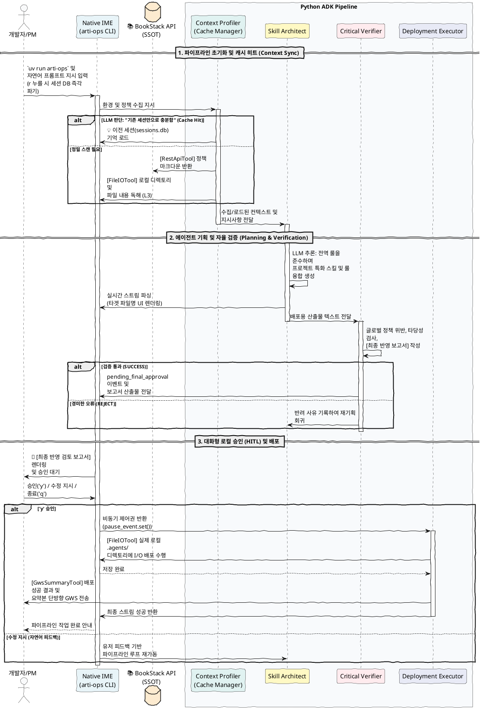

# 🛠️ [SSD] arti-ops v0.5.0 시스템 및 서비스 명세서 (개정판)

## 1. 시스템 아키텍처 개요

```text
[ TUI Layer (Local Console) ]
  └── 🖥️ Native IME 기반 Full-screen App
      ├── 📜 Main Viewer (상단/중앙) : 진행 과정 트리 (캐시 일치 여부 표시 포함), 에이전트 산출물, 최종 파일 반영 보고서 출력 뷰어
      ├── ⌨️ Input Prompt (하단) : 상시 활성화된 사용자 대화 및 지시어 입력창 (r: 초기화, q: 종료 명령 지원)
      └── ⚡ Event Handler : 'q', 'Ctrl+C' 즉시 종료 글로벌 바인딩

[ ADK Core Layer (Python) ]
  ├── ⚙️ Pipeline Engine : 이벤트 기반 비동기 흐름 제어 및 로컬 승인(HITL) 루프 관리
  ├── 🕵️ ContextProfiler : BookStack 정책(Read) + 현재 실행 경로(로컬 파일, .agents 등) 현황 병합 스캔
  ├── 🧠 SkillArchitect : 수집된 컨텍스트와 '사용자 프롬프트 지시'를 융합하여 Rule/Skill 생성 기획
  ├── 🧐 CriticalVerifier : 정책 위반 검증 및 TUI 화면 출력용 [최종 반영 보고서] 작성
  └── 🚀 DeploymentExecutor : 사용자 UI 승인(Y) 후 실제 로컬 File I/O 및 GWS 요약 송신

[ Integration Layer (Tools) ]
  ├── 📚 BookStackToolset : 정책 Fetch 전용
  ├── 📂 FileIOToolset : 로컬 파일 읽기(컨텍스트 수집) 및 쓰기(최종 배포)
  └── 💬 GwsSummaryTool : 배포 완료 후 단방향 요약 알림 전송 (Pause 기능 완전 제거)

```

## 2. 워크플로우 시퀀스 (Interactive Loop)

1. 사용자가 현재 타겟 경로에서 `arti-ops` 명령어 실행 ➔ 터미널 전체화면 TUI 앱 진입.
2. 하단 프롬프트에 지시 입력 (예: `"r"` 입력 시 즉시 세션 DB 파기 및 초기화).
3. **Profiler**가 로컬 파일 컨텍스트와 BookStack 정책을 수집. 단, 직전 대화 혹은 저장된 `sessions.db`의 컨텍스트로 충분하다고 LLM이 판단한 경우, 도구 호출을 생략하고 캐시 히트(Cache Hit) 메시지(`💡 이전 세션(sessions.db) 기억을 불러왔습니다.`)를 시각적으로 노출한다.
4. **Architect**가 지시와 컨텍스트를 바탕으로 `.agents/skills/...` 및 `.agents/rules/...` 규격에 맞춰 내용 기획 및 생성. 실시간 스트림 파싱을 통해 타겟 파일의 경로를 렌더링한다.
5. **Verifier**가 무결성 검증 후, TUI 화면에 **[반영 예정 파일 목록 및 상세 내용 요약 보고서]**를 제출하고 파이프라인 대기 상태 전환.
6. 사용자가 화면의 보고서를 검토 후 하단 프롬프트에 `승인(y)` 입력 시 **Executor** 가동. 이 때 비동기 Lock(`_pause_event.clear()`) 이슈가 없도록 즉각 블락 해제되어야 한다. `수정해줘` 등 자연어 입력 시 **Architect**로 루프 회귀.
7. 파일 I/O 배포 완료 후 GWS 채팅으로 최종 요약본 단방향 전송.

## 3. 시퀀스 다이어그램 (Sequence Diagram)

