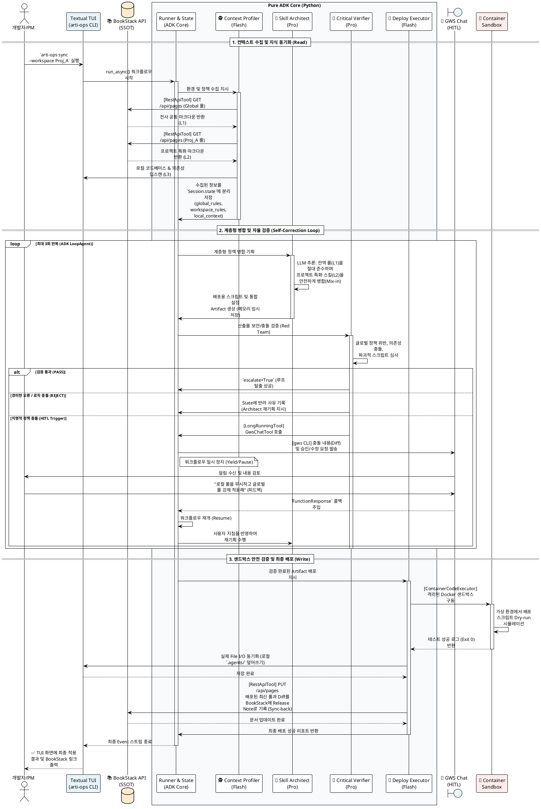

# 🛠️ [SSD] arti-ops v0.1.0 시스템 및 서비스 명세서

## 1. 시스템 아키텍처 개요 (System Architecture)

Pure Google ADK(Python)의 내장 객체들을 적극 활용하여 시스템을 구성합니다.

```text
[ Client Layer (Local PC) ]
  ├── 🖥️ Textual TUI (`arti-ops`) : Claude CLI 스타일의 마크다운 채팅(ChatBubble) 뷰어
  └── 📂 Target Workspace : 최종 산출물이 병합될 `.agents/` 디렉토리

[ ADK Core Layer (Python) ]
  ├── ⚙️ Runner & SessionService (Database) : 상태 및 배포 이력 영구 저장
  ├── 🕵️ ContextProfiler (Flash) : BookStack 및 로컬 디렉토리 환경 딥 스캔
  ├── 🧠 SkillArchitect (Pro) : 계층 정책 병합 및 배포 스크립트 작성
  ├── 🧐 CriticalVerifier (Pro) : 글로벌 정책 위반 검사 (Self-Correction Loop)
  └── 🚀 DeploymentExecutor (Flash) : 샌드박스 테스트 및 최종 파일 I/O

[ Integration Layer (ADK Tools) ]
  ├── 📚 BookStackToolset (RestApiTool) : BookStack API 통신 (Read/Write)
  ├── 💬 GwsChatTool (LongRunningFunctionTool) : HITL 승인 위한 gws CLI 구동 및 대기
  └── 🐳 SandboxTool (ContainerCodeExecutor) : Docker 기반 안전 격리 실행 환경 (의존성 부족 시 Lazy Load 스킵 처리)

```

## 2. BookStack 데이터 매핑 및 정책 계층 모델 (Hierarchy Model)

BookStack의 논리적 구조를 에이전트의 컨텍스트(스코프)로 1:1 매핑합니다.

| 계층 (우선순위) | BookStack (SSOT) 위치 | 매핑 스코프 (Scope) | 병합 및 반영 원칙 |
| --- | --- | --- | --- |
| **L1 (최상위)** | Book: `Antigravity Global` | **Global Scope** | 회사의 절대적인 보안 규칙. 어떠한 경우에도 로컬 설정이 이를 무시할 수 없음 (수정 불가). |
| **L2** | Book: `Workspace / Proj_A` | **Workspace Scope** | 프로젝트 PM이 위키에 문서화해 둔 도메인 특화 룰. L1과 충돌 시 L1의 가이드에 맞춰 AI가 자동 리팩토링함. |
| **L3** | Local PC (`package.json` 등) | **Local Context** | `ContextProfiler`가 스캔한 현재 로컬 코드베이스의 기술 스택 및 의존성 현황. |
| **L4 (최하위)** | Local PC (`.agents/`) | **Local Artifacts** | 개발자 PC에 남아있는 구형 룰. (상위 계층과 병합 후 덮어쓰기 됨) |

## 3. ADK Tool 연동 명세 (Integration Specs)

### 3.1. BookStackToolset (지식 동기화 모듈)

ADK의 `RestApiTool` 또는 `FunctionTool`을 활용하여 BookStack API를 에이전트 도구로 변환합니다. OS Keyring에 안전하게 저장된 Token을 사용합니다.

* **`fetch_policies(scope_tag: str, project_id: str)`**
* Global 호출 시 Global Book의 마크다운을 Fetch 하여 `Session.state['app:global_rules']`에 적재 (ReadOnly).
* Workspace 호출 시 해당 프로젝트 Book의 마크다운을 Fetch 하여 `Session.state['temp:workspace_rules']`에 적재.


* **`publish_sync_report(project_id: str, diff_md: str)`**
* 배포 성공 후, 병합된 최종 결과물과 Diff 내역을 해당 프로젝트의 BookStack 'Release Notes' 페이지에 `PUT` 요청으로 덮어씀 (문서 현행화).


### 3.2. GWS ChatTool (HITL 제어 모듈)

* ADK의 **`LongRunningFunctionTool`**을 사용하여 비동기 대기를 구현합니다.
* `Verifier`가 치명적 충돌을 감지하면 이 툴을 호출하며, 호출 즉시 ADK 워크플로우는 블로킹 없이 **일시 정지(Pause)**됩니다. PM이 승인하면 API 서버가 `FunctionResponse`를 주입하여 **재개(Resume)**합니다.

## 4. 시스템 동작 시퀀스 다이어그램 (PlantUML)

사용자가 `arti-ops sync --workspace Project_A` 명령어를 실행했을 때, BookStack에서 계층형 정책을 가져와 병합하고, 충돌을 검증(HITL)한 뒤 샌드박스를 거쳐 배포 및 역문서화하는 전체 엔드투엔드(E2E) 시퀀스입니다.

*(아래 코드를 복사하여 마크다운 뷰어나 [PlantUML Web](https://plantuml.com/ko/)에 붙여넣으시면 다이어그램 이미지를 확인하실 수 있습니다.)*

