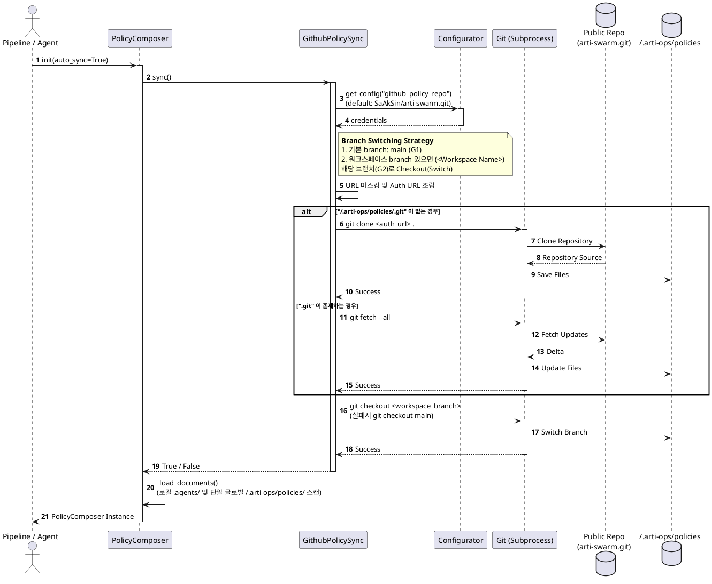

# 🛠️ [SSD] arti-ops v0.5.2 시스템 및 서비스 명세서 (개정판)

## 1. 시스템 아키텍처 개요

```text
[ TUI Layer (Local Console) ]
  └── 🖥️ Native IME 기반 Full-screen App (`list_viewer.py`)
      ├── 📜 Main Viewer (상단/중앙) : 진행 과정 트리, 파일 미리보기, L1 변환 및 Diff 표시
      ├── ⌨️ Input Prompt (하단) : 상시 활성화된 대화형 입력창
      └── 📁 Left Panel (목록) : `.agents` 하위의 폴더 병합 및 상태 스캔
          ├── [L2] 로컬 워크스페이스 파일 (최상위 우선순위 시스템)
          ├── [L1] 로컬 전역 파일 (Gemini ~/.gemini/antigravity 공용)
          ├── [G2] 북스택 워크스페이스 원격 (API plan_lookup 동기화)
          └── [G1] 북스택 글로벌 원격 (PolicyCache 동적 추출 및 즉시 프리뷰 렌더링 지원)

[ ADK Core Layer (Python) ]
  ├── ⚙️ Pipeline Engine (`pipeline.py`) : Profiler -> Architect -> Verifier -> Executor 순차 파이프라인
  ├── 🧠 PolicyCache (`policy_cache.py`) : DB 기반 세션 및 컨텍스트 재시작 효율화
  ├── 🔄 GithubPolicySync (`github_sync.py`) : [신규] 원격 GitHub 저장소 정책 동기화(GitOps) 모듈
  └── 🧩 PolicyComposer (`policy_composer.py`) : [신규] YAML 기반 마크다운 정책 동적 필터링 및 병합 모듈

[ Swarm Infrastructure Layer (새로 도입됨) ]
  ├── 📂 .agents/worktrees/ : 기능개발 및 각 에이전트(arti_core, arti_cli)의 비파괴적 독립 Git 작업 환경
  ├── 📂 .agents/board/ : 1-backlog ~ 7-failed 칸반 티켓 관리
  └── 🛡️ Ralph-Loop (`ralph-loop.sh`) : 3회 실패 방어 자가 검증 및 롤백 쉘
```

## 2. 워크플로우 시퀀스 (Interactive & Swarm Loop)

1. TUI 앱에서 사용자가 `arti-ops` 명령어 실행 (l 파라미터로 list_viewer 진입 가능)
2. `l` 뷰어 모드 내에서 L1 생성 미리보기(`g`), Bookstack Upsert 모달(`u`) 키 이벤트를 통해 비동기 상태 확인.
3. ADK 파이프라인(Context Profiler / Skill Architect / Critical Verifier / Deployment Executor)이 세션 단위로 동작.
4. **스웜 자율 주행(Auto-pilot)** 시, 백로그의 마크다운 파일(DependsOn 분석)을 워크트리 기반에서 `graphify` 지식 그래프를 우선 로드한 뒤 TUI를 거치지 않고 직접 작성 처리 후 `ralph-loop` 로 검증.

### 2.1 GitOps 정책 동기화 시퀀스 (GithubPolicySync)


## 3. 핵심 모듈 (Graphify 추출 기반)
- `BookStackToolset` (Community 0 브릿지): 워크스페이스 간 BookStack Sync 및 API 라우팅 집중 로드허브.
- `ArtiOpsPipeline`: 4개의 에러/검증 사이클 루프의 메인 관제 모듈. (향후 DAG 기반 StateManager 변경 논의됨)
- `Configurator` & `GwsChatTool`: 통합 설정 및 슬랙/구글통합 알림망.
- `GithubPolicySync` **[신규]**: `subprocess` 기반 순정 Git 명령어를 사용해 에이전트 구동 전 외부 GitHub 저장소의 정책(Private)들을 전역 글로벌 영역(`~/.arti-ops/policies`)으로 동기화(`clone`/`fetch`/`hard reset`). 토큰 마스킹 지원.
- `PolicyComposer` **[신규]**: 로컬 `.agents/` 디렉토리뿐만 아니라 글로벌 `~/.arti-ops/policies/` 디렉토리에 저장된 마크다운 기반의 Policies, Rules, Skills를 YAML Frontmatter를 통해 에이전트 용도(`purpose`) 및 버전에 따라 동적으로 필터/조합하여 시스템 프롬프트를 생성. (초기화 시 `GithubPolicySync` 연동)
